> **本报告回答一个问题**：假设你在武汉光谷东的国创光谷上城有一套 110㎡、南北通透、中间楼栋 14/33 层的三房，现在（2026 年 10 月）应该继续持有，还是应该出售？
>
> **本报告不构成投资、税务或法律建议。** 所有结论基于公开数据和明确写出的假设，参数可在配套 Excel 中自行修改。

---

## 一页结论

**结论：倾向出售。** 更准确地说，是"现在就启动出售，用 2–3 个月按市场价成交"，而不是继续等一个不确定的反弹，也不是降价甩卖。

支撑这个结论的四句话：

1. **小区自身的数据**：同户型成交价从 2025 年上半年的约 1.41 万元/㎡跌到 2026 年上半年的约 1.14 万元/㎡，2026 年三季度回到约 1.23 万元/㎡。目前是近一年里价格相对好、成交量也不错的一个窗口。
2. **武汉的数据**：成交量在回暖（2026 年 1–7 月二手网签创四年同期新高），但价格还没有（二手房价同比仍跌 10% 左右）。这叫"以价换量"，说明买方仍占主动。
3. **光谷的供给**：东湖高新区是武汉新房卖得最多的区（2026 年上半年 9,423 套），四代住宅在新房成交中的占比已升到近一半，还叠加了只给新房的购房补贴。一套 2017 年交付的二手三房，正在和这些新盘抢同一批改善型买家。
4. **算账**：这套房的净租金回报约 2.0%，低于房贷利率（约 3.1%）。测算显示，**未来三年房价只要不涨，现在卖就不吃亏**；房价每年跌 2%，三年后就少 8 万左右。

**什么情况下应该继续持有**：这是你唯一的自住房而且没有换房计划；或者孩子正在使用对应的学位。这两种情况下，房价的短期涨跌不应该左右你的决定。

**估值与定价建议**（详见第三章）：

| 项目 | 单价（元/㎡） | 总价（万元） |
|---|---:|---:|
| 保守估值（可比样本 25 分位） | 约 11,350 | 约 125 |
| **中性估值（可比样本中位数）** | **约 12,180** | **约 134** |
| 乐观估值（可比样本 75 分位） | 约 12,650 | 约 139 |
| 建议挂牌价 | — | 139–142 |
| 目标成交价 | — | 134–137 |
| 心理底价 | — | 约 125 |

---

## 1. 报告目的、数据与方法

### 1.1 我们用了什么数据

**微观数据**：来自经纪 App 的国创光谷上城成交记录截图共 20 张、80 条，成交日期从 2025 年 2 月 16 日到 2026 年 9 月 10 日。每条记录含户型、面积、楼层段（高/中/低）、朝向、成交日期、总价和单价。完整明细见配套 Excel《国创光谷上城_成交数据与卖房参考.xlsx》和 `data/成交明细.csv`。

**中观与宏观数据**：国家统计局、武汉市统计局/住房和城市更新局、中指研究院、易居研究院、克而瑞等机构在 2026 年 1–9 月发布的公开数据，以及主流财经媒体的报道。完整来源清单见附录 A。

### 1.2 数据的局限

- 80 条样本不算大。按季度切分后，有的季度只有 2–7 套，个别极端成交会明显拉动均价。因此本报告对小区价格**优先看中位数**，其次看面积加权均价。
- 截图之间疑似有遗漏：2025 年 8 月一条记录都没有，2025 年 4–5 月之间也有断档，2026 年 2 月无记录（可能是春节淡季）。
- 截图只显示"高/中/低"楼层段，没有具体层数；装修状况是按缩略图目测的，只做参考。
- 2 条记录状态为"已成交"（已签约未过户），其余为"已过户"。

### 1.3 分析框架

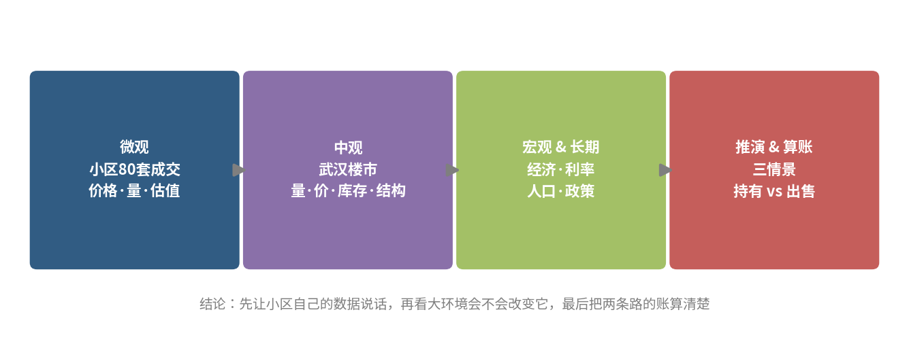

一句话概括：**先看这个小区的成交数据说了什么，再看武汉和全国的大环境会不会改变它，最后把"持有"和"出售"两条路的账算清楚。**

---

## 2. 微观：这个小区正在发生什么

### 2.1 价格：一年多跌了约 15%，2026 年下半年止跌企稳

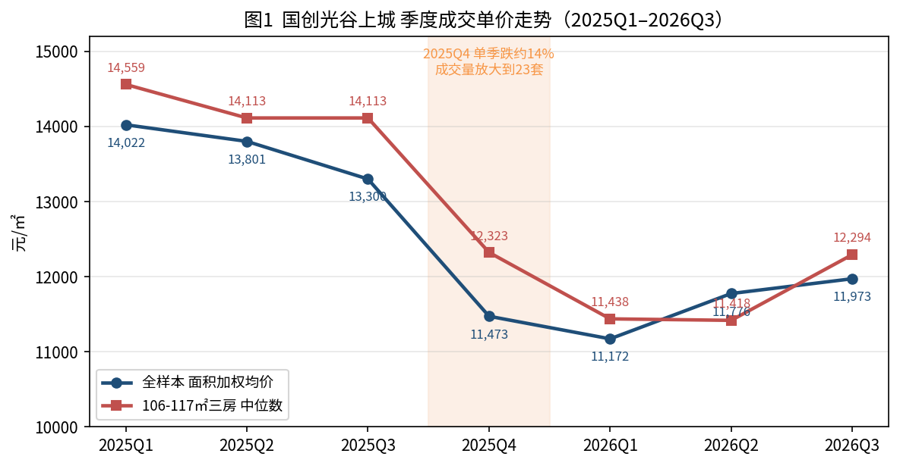

把 80 套成交按季度排开，走势非常清晰：

- **2025 年上半年**：全样本单价稳定在 1.38–1.40 万元/㎡，106–117㎡ 的大三房中位数约 1.41 万。
- **2025 年四季度**：断崖。全样本面积加权均价从三季度的 1.33 万跌到 1.15 万，单季跌幅约 14%。
- **2026 年一季度**：见底，加权均价约 1.12 万，比 2025 年一季度低约 20%。
- **2026 年二、三季度**：温和回升到 1.18–1.20 万。106–117㎡ 三房的中位数回到约 1.23 万，比 2025 年上半年仍低约 13%。

再往前看，链家/贝壳的小区页此前显示过 1.86–1.93 万元/㎡的参考均价（约 2021 年前后）。也就是说，**从更早的高点算，这个小区已经回撤了三成以上**；最近这一年多，是那轮下跌的最后一段。

### 2.2 成交量：越跌越卖

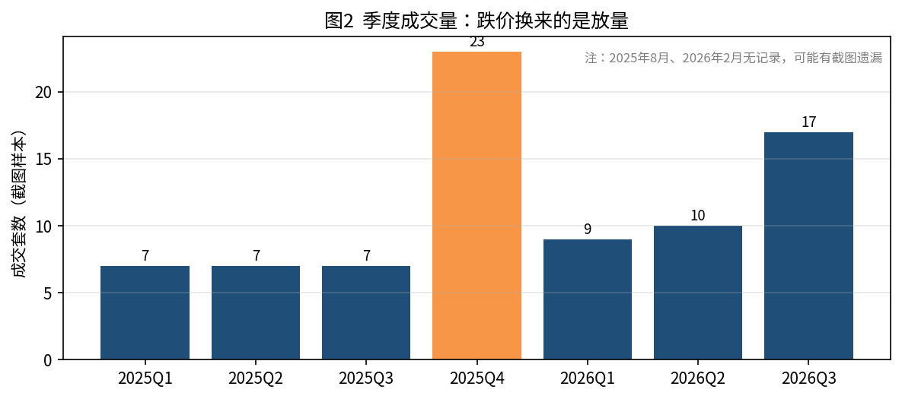

2025 年四季度价格断崖的同时，成交量冲到 23 套，是全年最高。2026 年三季度 17 套，也明显高于 2025 年上半年每季 7 套的水平。

这说明两件事：一是这个小区**流动性是好的**——2,500 户的大盘、地铁口、有学校，只要价格到位就有人接；二是买方对价格非常敏感，**成交是靠让价换来的**。对卖家来说，好消息是"卖得掉"，坏消息是"卖不贵"。

### 2.3 分户型：所有户型同步下台阶

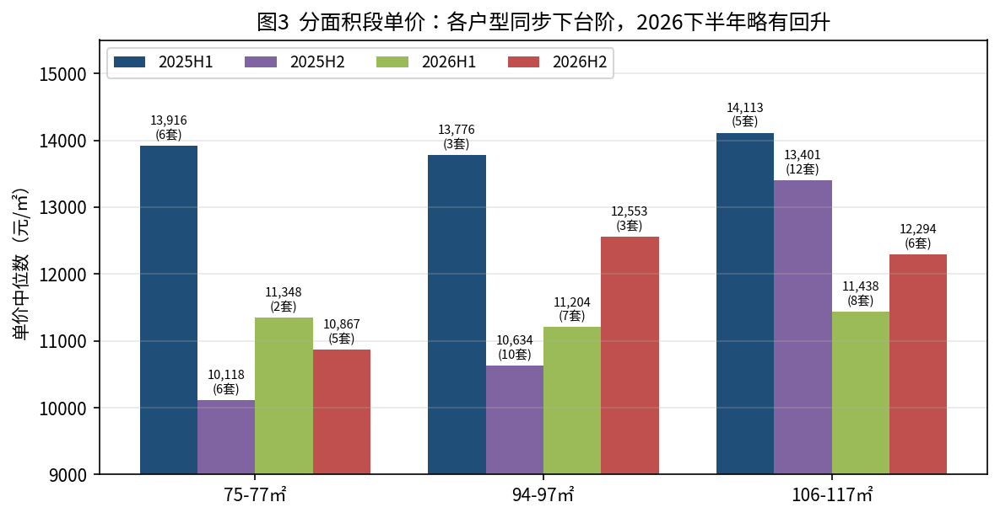

75–77㎡ 两房、94–97㎡ 三房、106–117㎡ 大三房，三条线的形状几乎一样：2025 年上半年高位，2025 年下半年下台阶，2026 年上半年见底，2026 年下半年略回升。没有哪种户型独立于大势。

值得注意的是，大三房在 2025 年下半年的中位数（1.34 万）明显高于两房（1.01 万）。原因是这个户型在 2025 年三季度还成交了几套 1.4 万以上的高价，四季度才跟上跌势。**大户型的调整比小户型晚了一个季度**，但幅度最终是一样的。

### 2.4 同户型价差可达 40 万：怎么卖比何时卖更重要

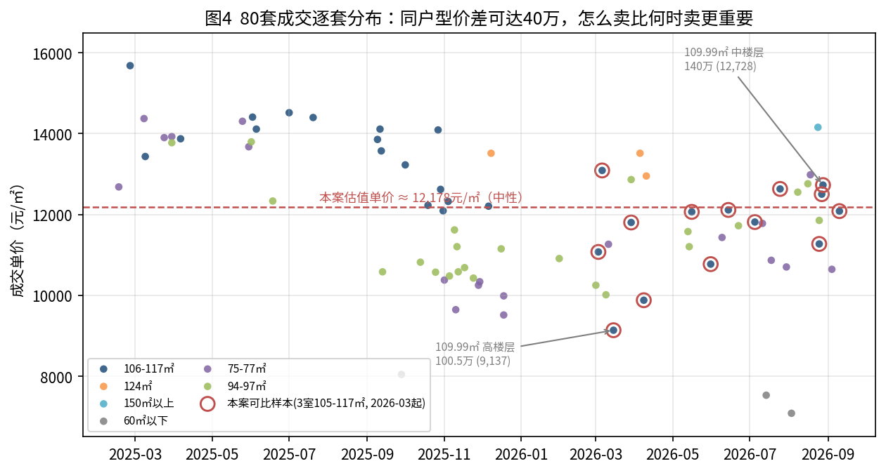

图 4 把 80 套成交逐套画出来。同样是 109.99㎡ 的三房：

- 2026 年 3 月，一套高楼层成交 100.5 万（9,137 元/㎡）。
- 2026 年 8 月，一套中楼层成交 140 万（12,728 元/㎡）。

差了近 40 万。中间隔了五个月，市场整体只回升了几个百分点，剩下的差距来自房子本身（楼层、装修、房况）和卖家心态（急售还是等价）。对你来说，这意味着**定价策略、房况整理和出售节奏的影响，不比"选哪个季度卖"小**。

### 2.5 本案值多少钱

估值方法：取 2026 年 3 月以来成交的 3 室、105–117㎡ 的 14 套作为可比样本，看它们的单价分布，再按本案特点（南北通透、中楼层、中间楼栋）做小幅调整。

| 可比样本统计（14 套） | 元/㎡ |
|---|---:|
| 25 分位 | 11,124 |
| 中位数 | 11,940 |
| 75 分位 | 12,406 |
| 2026 年 7–9 月 6 套均价 | 12,173 |

对本案的调整：南北通透 +1%，中楼层/中间楼栋 +1%，装修按实际填写（默认 0）。合计 +2%。这两个溢价是**假设值**——样本里南北通透和纯南向的成交价差异并不显著，所以给得很保守。

| 估值情形 | 单价（元/㎡） | 总价（万元） |
|---|---:|---:|
| 保守（25 分位） | 11,346 | 124.8 |
| **中性（中位数）** | **12,178** | **134.0** |
| 乐观（75 分位） | 12,654 | 139.2 |
| 参考：近三个月均价 | 12,416 | 136.6 |

最直接的对标是 2026 年 8 月 28 日那套 109.99㎡、中楼层、纯南的三房，成交 140 万。你的房子南北通透，理论上不应该比它差。所以**134–137 万是合理的目标区间，140 万是上限**。

---

## 3. 中观：武汉楼市——量在回暖，价还没有

### 3.1 价格：同比跌幅收窄，但仍是两位数

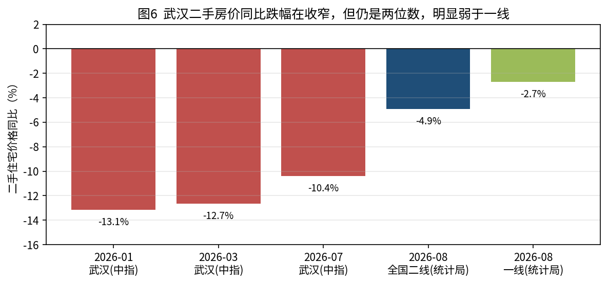

- 中指研究院数据：2026 年 1 月武汉二手住宅价格同比下跌 13.14%；3 月同比下跌 12.66%；7 月武汉二手住宅均价 12,893 元/㎡，环比跌 0.62%，同比跌 10.40%。
- 国家统计局口径温和一些：武汉二手房价格在 2026 年 4 月结束了连续 15 个月的下降，出现环比微涨；7 月环比持平。
- 全国对比：2026 年 8 月，一线城市二手住宅价格同比下降 2.7%，二线城市下降 4.9%，三线城市下降 5.6%。武汉的 -10% 明显弱于同类城市平均水平。

两个口径的差异在于：统计局的指数经过质量调整，中指的均价受成交结构影响更大。**但方向一致——跌幅在收窄，跌势还没结束。**

### 3.2 成交量与库存：二手挂牌明显消化，新房库存仍偏高

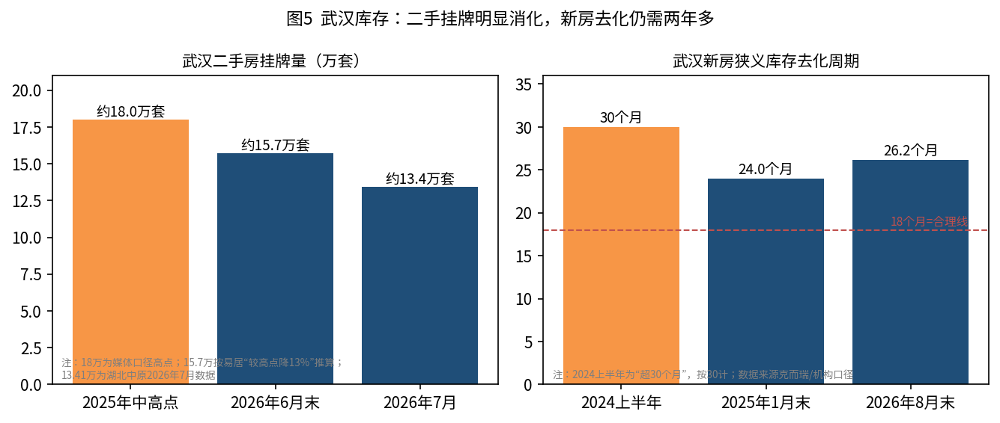

- **二手成交**：2026 年 1–7 月武汉二手房累计网签 5.84 万套，是过去四年同期最高，比 2025 年同期涨 9%，而且反超了新房。
- **二手挂牌**：武汉二手房挂牌量从 18 万套的高位一路降到约 13 万套。易居研究院的口径是：截至 2026 年 6 月末，武汉挂牌量较历史高点下降 13%（同期杭州降 39%、广州降 32%、上海降 31%）。
- **新房**：2026 年前 8 个月武汉新房网签 61,265 套，同比增 3.4%。但机构口径的狭义可售库存仍约 1,381 万㎡，按近 12 个月流速计算去化周期约 26.2 个月。远城区更长，东湖高新、武昌、汉阳相对短。

解读：挂牌量下降是好事，意味着恐慌性抛售在减少。但武汉的降幅（13%）在重点城市里是最小的一档，说明**武汉二手市场的出清比一线城市慢**。新房 26 个月的去化周期，也高于 18 个月左右的合理线。

### 3.3 结构性变化：四代住宅正在重新定义"好房子"

这是本轮武汉楼市最重要的结构变化，也是对本案最直接的压力：

- 武汉四代住宅在新房成交中的占比从 2026 年 1 月的 22% 升到 5 月的 48%。2026 年上半年，1–4 月全市住宅销售前十里有 7 个是四代住宅项目。
- 2025 年武汉 38 个新上市高品质住宅项目首开平均去化超过 70%，全年 15 次开盘即售罄；2026 年新上市的四代住宅首开去化仍保持在 70% 以上。
- 业内判断：随着"好房子"战略推进，四代住宅将逐渐拉大与存量住宅的产品代际差。

通俗地说：**同样一百多万，买家可以在光谷买到得房率更高、有空中花园、有风雨连廊的新房，为什么要买一套 2017 年交付的老户型？** 这就是二手房"以价换量"的根源。它不是短期情绪，而是产品代际的差距，短期不会逆转。

### 3.4 光谷板块：产业最强，供应也最多

光谷对本案是一把双刃剑。

**强的一面**：截至 2025 年，光谷光电子信息产业规模突破 6,500 亿元，1.6 万家光电子信息企业在此集聚，经济总量占武汉 GDP 的比重从 2020 年的 12.8% 升到 15% 以上；72 家光谷上市公司总市值突破万亿。省委提出打造万亿规模的"世界光谷"。AI 带来的算力需求，让光通信、光模块、存储芯片这些光谷的"硬通货"表现抢眼。这意味着**光谷的就业和人口流入是全武汉最有支撑的**。

**弱的一面**：正因为产业强，开发商也最愿意在这里推盘。东湖高新区 2026 年上半年新房成交 9,423 套，领跑全市，占比超过 21%。"汉七条"还专门对在东湖高新区购买新建商品住房的家庭给予房款 1.5%（首套）或 1%（二套）的补助。**光谷的新房供应最多、政策最偏向新房，二手房受到的挤压也最重。**

对本案的判断：国创光谷上城所在的光谷东（高新大道与教育中路交汇处，11 号线湖口站，紧邻山姆会员店、光谷九小）在光谷内部属于配套成熟的板块，这是它跌得比远郊慢、卖得比远郊快的原因。但它没有能力独立于光谷的整体供需。

---

## 4. 宏观：经济、利率与周期位置

### 4.1 经济增长：全国放缓，武汉跑赢

- 全国：2026 年上半年 GDP 同比增长 4.7%，其中一季度 5.0%、二季度 4.3%。上半年固定资产投资同比下降 5.7%，房地产是主要拖累。
- 武汉：2025 年 GDP 22,147 亿元，增长 5.6%；2026 年上半年 GDP 11,236 亿元，同比增长 5.7%，高于全国，创近 5 年同期新高，规上工业增加值增长 15.4%。

武汉的经济基本面是这份报告里最"硬"的利好。它意味着武汉不是一个正在失去产业和人口的城市，本案所在的资产不会走向"卖不掉"。但经济增长和房价的关系在本轮周期里已经脱钩——武汉 GDP 增速全国领先的同时，二手房价同比仍跌 10%。**经济好只能保证"有人买"，不能保证"买得贵"。**

### 4.2 房地产行业：供给端深度收缩，这是中期的利好

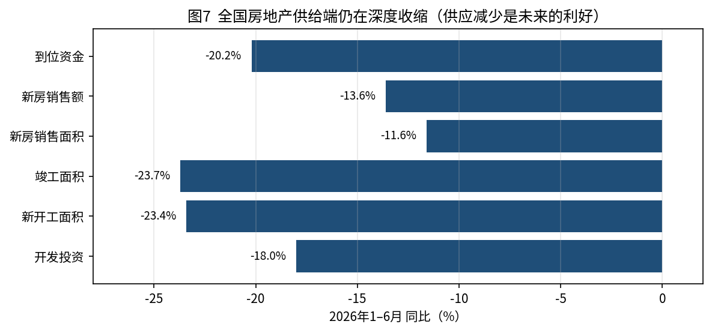

2026 年 1–6 月全国房地产开发投资同比下降 18.0%，新开工面积下降 23.4%，竣工面积下降 23.7%，新建商品房销售面积下降 11.6%，销售额下降 13.6%。房企到位资金下降 20.2%。

怎么理解这组数字？**供给端的收缩比需求端更快**。新开工连续几年两位数下滑，意味着两三年后市场上的新房会明显减少。这是房价中期企稳的基础——但它作用于 2028 年以后，不是 2027 年。而且它对"好房子"的支撑大于对老二手的支撑。

另一方面，全国二手房市场在结构上正在替代新房：2026 年 1–6 月全国二手房网签面积同比增长 10.2%，重点城市二手房挂牌量持续下降，二手房价格趋于稳定。中指研究院的判断是"十五五"中后期整体市场走出低迷，并且**分化是最重要的特征**——人口流入、经济基础好、就业面好的城市有望率先走出低迷。武汉在这个名单上，但排在上海、北京、深圳、杭州、成都之后。

### 4.3 利率与资金成本

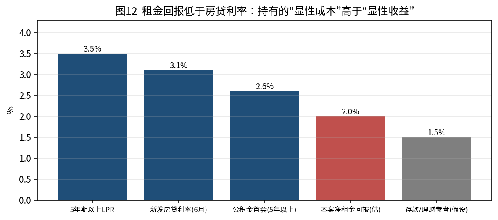

- 5 年期以上 LPR 为 3.5%，已连续 16 个月不变，上一次调整是 2025 年 5 月。
- 2026 年 6 月个人住房新发放贷款利率约 3.1%。
- 首套住房公积金贷款利率（5 年以上）为 2.6%。
- 房地产信贷新规明确个人住房贷款最长期限延长至 40 年。
- 商业银行净息差已降至 1.40% 的历史低位，这是 LPR 缺乏下调动力的原因。

对本案的含义：**买方的资金成本处于历史低位，而且贷款年限拉长后月供压力进一步下降**，这对"卖得出去"是明确利好。但对持有者来说，房贷利率 3.1% 和净租金回报 2.0% 之间有 1 个点的缺口，这是持有的显性成本。**利率继续大幅下降的空间有限**（银行息差已经很薄），指望"降息把房价托起来"并不现实。

---

## 5. 长期：人口与城市的十年

### 5.1 全国人口：拐点已过

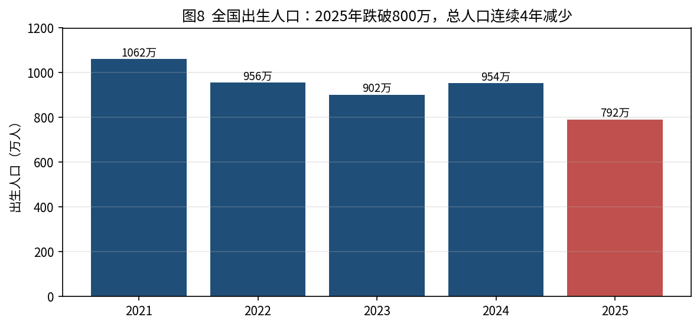

- 2025 年末全国人口 140,489 万人，比上年末减少 339 万人，连续第四年下降。
- 2025 年出生人口 792 万人，出生率 5.63‰，是 1949 年以来最低，首次跌破 800 万；死亡人口 1,131 万人。
- 60 岁及以上人口占 23.0%，65 岁及以上占 15.9%。城镇化率 67.89%，比上年提高 0.89 个百分点。

住房需求的长期决定因素是"多少人、多少家庭、多少收入"。全国层面，**人口总量在减少、老龄化在加深、城镇化接近尾声**——这三点共同决定了全国住房总需求的长期方向是下行的。但这是"全国平均"，不等于每个城市。

### 5.2 武汉人口：省内唯一增长极，但增量已不大

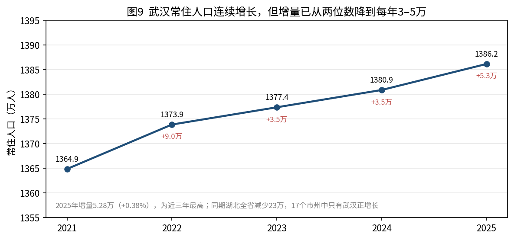

- 2025 年末武汉常住人口 1,386.19 万人，城镇化率 85.22%，户籍人口 961.34 万人。
- 2025 年武汉常住人口增长 5.28 万人，为近三年新高（2023 年、2024 年分别为 3.5 万、3.51 万），连续三年正增长，位列全国人口十强城市第七。
- 2025 年武汉累计吸引 31.4 万名高校毕业生留汉来汉，连续多年是人才净流入城市。
- 同期湖北全省常住人口 5,811 万人，比上年末减少 23 万人；全省出生率 4.26‰，60 岁及以上占 23.6%。17 个市州中只有武汉正增长。

武汉的人口结构对本案是**中性偏正面**：它是湖北乃至中部人口的"蓄水池"，靠大学毕业生和省内流入维持增长，光谷是流入的主要目的地之一。但每年 3–5 万的增量，相对 1,386 万的存量只有 0.3–0.4%，**这个增速支撑不了 2016–2021 年那样的房价上涨，只能支撑"不崩"**。

### 5.3 对住房需求的含义

把人口结论翻译成住房语言：

| 人口趋势 | 对武汉光谷二手三房的含义 |
|---|---|
| 全国出生人口跌破 800 万 | 未来 10–20 年"刚需"总量下行；学区房的溢价会逐渐减弱 |
| 全国 60 岁以上占 23% | 老年人口以持有存量房为主，不产生新增购买；未来会有遗产房源释放 |
| 城镇化率 68%，武汉 85% | 武汉靠"农民进城"带来的需求已经基本结束 |
| 武汉每年净增 3–5 万人、31 万毕业生 | 租赁需求稳定，是租金的支撑；但毕业生首次置业周期长、预算低，先买小户型 |
| 湖北全省人口减少 | 省内三四线城市的购房者向武汉集中，是武汉优于省内其他城市的原因 |

**结论：人口因素决定了武汉的房子长期是"可以持有的资产"，但不是"会明显升值的资产"。** 它能守住的是流动性和租金，守不住的是 2021 年的价格。

---

## 6. 政策：方向明确，力度有限

### 6.1 中央基调：从"止跌回稳"到"着力稳定"

- 2026 年政府工作报告对房地产的表述是"着力稳定房地产市场"，具体包括：因城施策控增量、去库存、优供给；探索多渠道盘活存量商品房，鼓励收购存量商品房重点用于保障性住房；深化住房公积金制度改革；有序推动"好房子"建设；深入推进房地产发展新模式的基础制度建设。
- 2026 年 3 月 13 日发布的"十五五"规划纲要多次提及房地产，专家解读为未来五年房地产政策转向以保障民生为重心，更注重提升居住品质。
- 2026 年 5 月 28 日国务院发布《城市更新"十五五"规划》，在存量资源盘活、住房品质提升、老旧住房更新改造、房地产新模式构建等领域出台多项支持政策。

**读政策的关键是看它想"稳"什么。** 2026 年的政策重心是三件事：不让市场再大跌（防风险）、把库存消化掉（去库存）、把新房做好（好房子）。这三件事对存量二手房的影响分别是：正面、中性、负面。政策的目标是"稳"，不是"涨"。指望政策把价格重新推上去，2024 年底那一轮已经证明了不现实——2024 年 12 月武汉二手住宅价格环比上涨 0.2%，被解读为回暖信号；但本小区的数据显示，价格撑到 2025 年上半年，四季度就跌了 14%。

### 6.2 武汉本地：政策工具箱已经用了大半

- 2025 年 4 月 30 日"汉九条"：加大金融支持、补贴、以旧换新升级。
- 2026 年 1 月《关于进一步促进本市住宅品质提升的若干意见》：车库设于半地下、风雨连廊、设备平台不计容等 9 项举措，推进从"有房住"到"住好房"。
- 2026 年 4 月 30 日"汉七条"：按区认定首套房、公积金松绑、分区购房补贴（新房）、加大商办类房屋支持。
- 2026 年 6 月 1 日《武汉城市更新条例》落地，年底目标 100 个"好房子"标杆。
- 目标：2025 年建设"好房子"项目 55 个，2026 年预计再上市 100 余个。

武汉的政策方向和中央一致：**降低买方门槛（利好成交），把资源导向新房和好房子（利空老二手）**。限购限贷类工具已经基本用完，剩下的是补贴和公积金这类边际工具。

### 6.3 政策会救房价吗

分三种情形说：

- **"托底"类政策**（降利率、放宽认定、补贴）：已经在用，效果是成交量回升，价格企稳但不反转。这是当前状态。
- **"收储"类政策**（政府收购存量商品房做保障房）：2026 年政府工作报告明确鼓励。如果大规模落地，会减少市场上的挂牌供应，对二手价格是实质性利好。但目前进展以新房库存为主，对武汉二手市场的影响还没有显现。
- **"强刺激"类政策**（大幅降息、大规模货币化安置）：目前看不到迹象。银行净息差 1.40%、财政以化债和民生为重心，都限制了大规模刺激的空间。

我的判断：**政策会继续"托"，但不会"推"。** 政策能保证的是这套房子不会出现 2025 年四季度那样的单季暴跌，不能保证它涨回去。

---

## 7. 推演：三个时间尺度、三种情景

### 7.1 短期（未来 6–12 个月）

- **成交量**：大概率维持高位。40 年房贷、低利率、金九银十和年底冲量，都支持成交。
- **价格**：小区层面大概率在 1.15–1.25 万元/㎡之间震荡。2026 年三季度的小幅回升只有 6 套样本支撑，不能当成趋势。
- **风险点**：2025 年四季度的"放量下跌"有可能在 2026 年四季度重演——年底急售业主增多、新盘年末冲量。

### 7.2 中期（1–3 年）

- 全国新开工的深度收缩会在 2028 年前后开始减少新房供应，但光谷手里的存量新盘和已出让土地够卖两年以上。
- 四代住宅的"代际差"会持续压制 2015–2020 年交付的二手房，这批房子在光谷的存量非常大。
- 中指研究院对"十五五"的判断是中后期走出低迷，且分化明显。武汉不在第一梯队。

**基准判断：2027–2028 年，本案价格在横盘到每年微跌 2–3% 之间。**

### 7.3 长期（5–10 年）

- 全国人口和城镇化的拐点已经过去。武汉靠人口流入维持温和增长，光谷是流入的主要承接地。
- 到 2030 年前后，国创光谷上城房龄 13 年，进入"次新房"到"老小区"的过渡期，物业和外立面的老化会开始影响价格。
- 光谷新城（光谷中心城、东湖科学城方向）的持续建设，会让居住重心继续东移，光谷东的区位仍然不差。

**长期判断：这是一套"能保值、有租金、卖得掉"的资产，不是"会升值"的资产。**

### 7.4 情景表

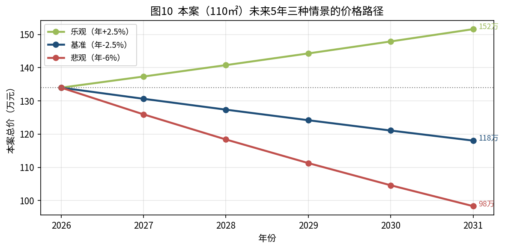

| 情景 | 主观概率 | 未来 12 个月 | 未来 3 年累计 | 触发条件 |
|---|:--:|:--:|:--:|---|
| **基准：横盘微跌** | 50% | -3% ~ +1% | -8% ~ 0% | 政策继续"托底"，成交量维持，四代住宅持续分流 |
| **悲观：再下台阶** | 30% | -5% ~ -10% | -15% ~ -25% | 年底急售增多、光谷新盘集中降价、宏观走弱 |
| **乐观：温和回升** | 20% | +3% ~ +5% | +5% ~ +12% | 大规模收储落地、意外降息、光谷产业爆发带动人口加速流入 |

概率是我的主观判断，写出来是为了让你能反驳它。**期望值（概率加权）是未来 3 年累计约 -7%**。

---

## 8. 算账：持有 vs 出售

### 8.1 模型

比较两条路在 3 年后的资产：

- **出售**：现在按 134 万估值卖出，让价 2%、交易成本 1%，到手资金按年化 2% 滚存。
- **持有**：3 年后按变动后的价格卖出（同样扣让价和成本），另加 3 年净租金。

假设：月租金 3,000 元（需以贝壳/安居客同户型在租价格核实；光谷政府人才公寓 97–117㎡ 三房月租 1,790–2,070 元，对市场租金有压制），年空置 1 个月，物业费 2.8 元/㎡·月，年维修 3,000 元。算出年净租金约 2.63 万元，净回报约 2.0%。

### 8.2 结果

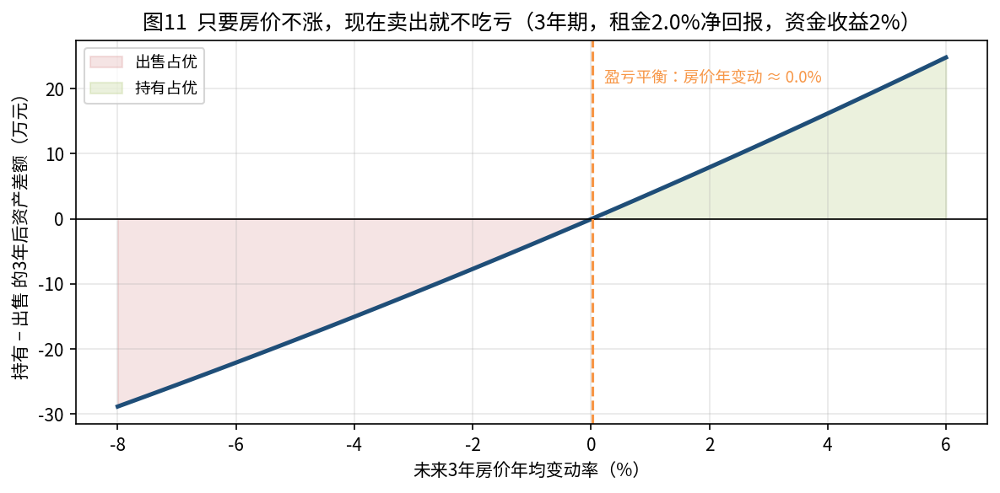

| 未来 3 年房价年均变动 | 持有 3 年后资产 | 出售 3 年后资金 | 差额（持有 − 出售） | 结论 |
|:--:|--:|--:|--:|:--:|
| -6% | 115.8 万 | 137.9 万 | -22.1 万 | 出售占优 |
| -4% | 122.9 万 | 137.9 万 | -15.0 万 | 出售占优 |
| -2% | 130.2 万 | 137.9 万 | -7.7 万 | 出售占优 |
| 0% | 137.9 万 | 137.9 万 | -0.1 万 | 基本打平 |
| +2% | 145.8 万 | 137.9 万 | +7.9 万 | 持有占优 |
| +4% | 154.1 万 | 137.9 万 | +16.2 万 | 持有占优 |

**盈亏平衡点：房价年均变动 ≈ 0%。** 也就是说，持有这套房的前提是你相信它未来三年会涨。按第 7 章的情景，基准和悲观合计 80% 的概率是不涨或下跌。

三个补充：

1. **如果有房贷**：把"资金收益率"换成房贷利率（约 3.1%），出售的优势扩大——因为卖房还贷相当于拿到 3.1% 的无风险收益。
2. **如果自住**：把"月租金"理解为"自住省下的房租"，模型同样成立。这时结论会从"出售占优"变成"基本打平"，所以自住不必为了择时而卖。
3. **税费**：小区 2017 年竣工，多数业主已满五年。满五唯一免个税，满两年免增值税。请以税务部门核定为准。

---

## 9. 结论与建议

### 9.1 决策矩阵

| 你的情况 | 建议 | 理由 |
|---|:--:|---|
| 非自住/闲置/投资性持有 | **出售** | 净租金 2% 低于资金成本，房价期望值为负，80% 概率不涨 |
| 唯一自住房，没有换房计划 | 持有 | 自住效用抵消持有成本，账面波动不兑现；搬家和租房的摩擦成本不值得 |
| 自住，计划在武汉换房 | **尽快先卖后买** | 新旧房在同一市场，重要的是价差不是绝对价；买方市场下先卖更从容 |
| 孩子正在使用对应学位 | 持有到用完 | 非价格因素优先于房价预判 |
| 有 3.5% 以上利率的房贷、无更好资金用途 | **出售并还贷** | 相当于锁定 3.5% 的无风险收益 |
| 强烈相信明年会有大规模刺激 | 可持有，但设止损 | 例如跌破 125 万即出售 |

### 9.2 如果决定出售：执行方案

**时间**：10–12 月启动。理由是当前处于近一年价格相对好的窗口，年底前买方有信贷和冲量支持；如果拖到明年，要面对 2027 年新一批四代住宅的入市。

**定价**：

- 挂牌价 139–142 万（中性估值 × 1.04，给议价空间）。
- 目标成交价 134–137 万。
- 底价约 125 万。低于这个价，不如持有并出租。

**准备**：

1. 确认产权年限（满五唯一）、贷款结清路径，让中介提前测算买方税费——税少是这套房相对新房的核心优势之一。
2. 房况整理：深度保洁、修补墙面、必要的软装。样本显示同户型价差可达 40 万，房况是其中最可控的变量。
3. 卖点排序：地铁 11 号线湖口站、山姆、光谷九小、南北通透、中间楼栋、中楼层、税少。这套房的目标客群是光谷上班、有孩子、预算 130–150 万的改善型家庭。
4. 中介策略：2–3 家主流中介同时挂，前两周观察带看量；带看少于每周 3 组，说明挂牌价偏高。
5. 议价节奏：第一个月坚持目标价，第二个月接受目标区间下沿，第三个月考虑底价。不要一开始就让到底。
6. 交易安全：资金监管、过户前不交钥匙、买方贷款审批通过后再网签。

### 9.3 如果决定持有：怎么持有

- 出租而不是空置。空置一年的成本约等于跌价 2%。
- 设定一个"复评"时间点（例如 2027 年 3 月小阳春后）和一个"止损"价格（例如 125 万），到时候重新看一次数据。
- 关注三个指标：小区季度成交中位数、武汉二手房挂牌量、光谷新房月度成交。三个同时转好，再考虑长期持有。

### 9.4 风险与不确定性

- **样本风险**：80 套样本、可能有截图遗漏，本案估值区间可能偏差 ±3%。
- **政策风险**：如果出现超预期的收储或货币化安置，房价可能出现一轮 10% 以内的反弹。卖出后会错过。
- **板块风险**：光谷新盘集中降价或某个大盘出现交付问题，会拖累周边二手房价格。
- **数据口径**：本报告混用了统计局指数、中指均价、机构库存等不同口径的数据，方向一致但数值不可直接比较。

---

## 附录 A：数据来源

| 类别 | 数据 | 来源 |
|---|---|---|
| 小区成交 | 80 条成交记录（2025-02 至 2026-09） | 经纪 App 截图（用户提供，2026-09-30） |
| 小区信息 | 2017 年竣工、约 2,500 户、容积率 2.5、物业费 2.8 元/㎡·月、高新大道与教育中路交汇处、11 号线湖口站、光谷九小旁 | 贝壳/链家/安居客/房天下小区页 |
| 全国房价 | 2026 年 8 月 70 城房价：一线二手同比 -2.7%、二线 -4.9%、三线 -5.6% | 国家统计局，2026-09-15 |
| 武汉房价 | 2026 年 1/3/7 月武汉二手同比 -13.14%/-12.66%/-10.40%，7 月均价 12,893 元/㎡ | 中指研究院（经腾讯新闻、房天下转引） |
| 武汉房价 | 2026 年 4 月武汉二手房结束连续 15 个月下降 | 国家统计局（经中国房地产报转引） |
| 武汉成交 | 2026 年 1–7 月二手网签 5.84 万套；1–8 月新房网签 61,265 套 | 武汉市住房和城市更新局 |
| 武汉库存 | 二手挂牌 18 万→13.41 万套；新房狭义库存约 1,381 万㎡、去化 26.2 个月；较高点降 13% | 湖北中原、克而瑞、易居研究院 |
| 武汉结构 | 四代住宅占比 22%→48%；东湖高新上半年新房 9,423 套 | 武汉市住房和城市更新局、中指研究院 |
| 全国宏观 | 2026 年上半年 GDP +4.7%；房地产投资 -18.0%、新开工 -23.4%、销售面积 -11.6% | 国家统计局，2026-07-15 |
| 武汉宏观 | 2025 年 GDP 22,147 亿元 +5.6%；2026 年上半年 +5.7% | 武汉市统计局 |
| 利率 | LPR 5 年期 3.5%（2026-09-20）；新发房贷约 3.1%（2026-06）；公积金首套 2.6%；房贷最长 40 年 | 中国人民银行、每日经济新闻、上海证券报 |
| 全国人口 | 2025 年末 140,489 万人（-339 万）；出生 792 万；60 岁以上 23.0% | 国家统计局，2026-01-19 |
| 武汉人口 | 2025 年末 1,386.19 万人（+5.28 万）；城镇化率 85.22% | 武汉市 2025 年统计公报 |
| 湖北人口 | 2025 年末 5,811 万人（-23 万） | 湖北省 2025 年统计公报 |
| 光谷产业 | 光电子信息产业超 6,500 亿元；1.6 万家企业；72 家上市公司市值超万亿 | 湖北日报、投资界 |
| 政策 | 2026 年政府工作报告；"十五五"规划纲要；城市更新"十五五"规划；汉七条；武汉住宅品质提升意见 | 国务院、武汉市住房和城市更新局 |

完整链接见仓库 `sources.md`。

## 附录 B：关键假设清单

| 假设 | 取值 | 可修改位置 |
|---|---|---|
| 可比样本条件 | 3 室、105–117㎡、2026-03-01 起 | Excel「本案估值」C7:C9 |
| 南北通透溢价 | +1% | Excel「本案估值」C22 |
| 中楼层/中间楼栋溢价 | +1% | Excel「本案估值」C23 |
| 装修调整 | 0% | Excel「本案估值」C24 |
| 挂牌议价空间 | 4% | Excel「本案估值」C35 |
| 月租金 | 3,000 元 | Excel「持有vs出售测算」B10 |
| 年空置 | 1 个月 | 同上 B11 |
| 物业费 | 2.8 元/㎡·月 | 同上 B12 |
| 年维修 | 3,000 元 | 同上 B13 |
| 卖房资金年化收益 | 2.0% | 同上 B14 |
| 出售让价 / 交易成本 | 2% / 1% | 同上 B7 / B8 |
| 情景概率 | 基准 50% / 悲观 30% / 乐观 20% | 本报告第 7.4 节，主观判断 |

## 附录 C：仓库文件说明

```
houseanalysis/
├── README.md                      仓库说明
├── sources.md                     数据来源与链接
├── report/
│   ├── 国创光谷上城_持有还是出售_分析报告.md     本报告（Markdown）
│   └── 国创光谷上城_持有还是出售_分析报告.docx   本报告（Word）
├── data/
│   ├── 成交明细.csv                 80 条成交记录
│   ├── 宏观与人口数据.csv           报告引用的宏观/人口/政策数据点
│   └── 国创光谷上城_成交数据与卖房参考.xlsx   明细 + 走势 + 估值 + 持有/出售测算（公式版）
├── charts/                        报告中的全部图表（PNG）
└── scripts/
    ├── data.py                    成交数据（Python 结构）
    ├── build_excel.py             生成 Excel
    ├── make_charts.py             生成图表
    └── build_docx.sh              Markdown → Word
```

原始截图含经纪人个人信息（水印），未纳入仓库。
